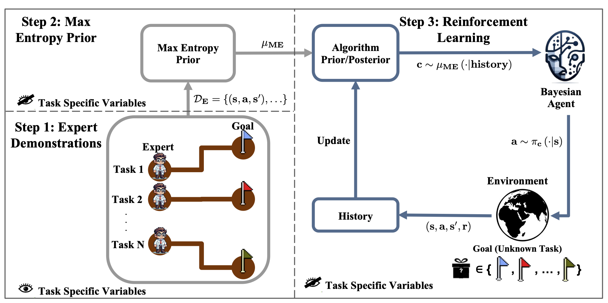

# Experts-as-Priors: Sequential Decision Making with Expert Demonstrations under Unobserved Heterogeneity

<p align="center" markdown="1">
    
<!--     <a href="https://arxiv.org/abs/2404.07266"></a> -->
</p>

<p align="center">
  <a href="#installation">Installation</a> •
  <a href="#experiments">Experiments</a> •
  <a href="#citation">Citation</a>
</p>

<p align="center">

</p>

## Installation

Set up a virtual environment and load it
```bash
python -m venv $ENV_NAME
source $ENV_NAME/bin/activate
```
Install `jax==0.4.14`:
```bash
pip install jax==0.4.14 jaxlib==0.4.14+cuda11.cudnn86 -f https://storage.googleapis.com/jax-releases/jax_cuda_releases.html
```
Then, install the `flashbax` package via
```bash
pip install git+https://github.com/instadeepai/flashbax.git
```
Finally, other requirements are installed with `pip install -r requirements.txt`

## Experiments
For bandit experiments, follow the notebook [`notebooks/bandit.ipynb`](./notebooks/bandit.ipynb). For deep sea experiments, run [`notebooks/deep_sea.ipynb`](./notebooks/deep_sea.ipynb).
```
